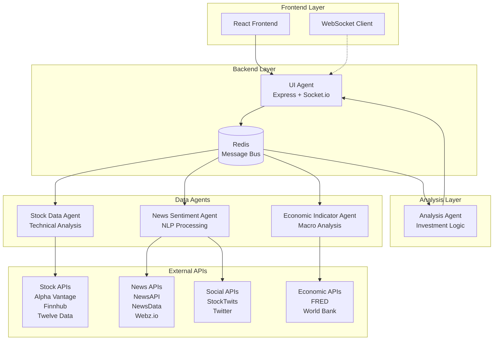
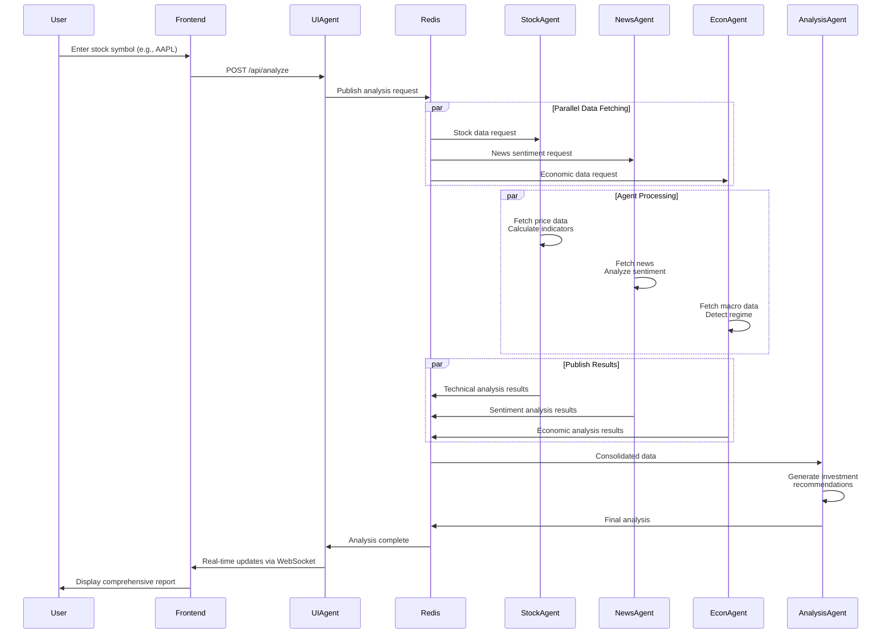
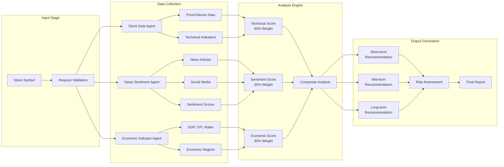

# 📈 AI-Powered Stock Analysis Application

A sophisticated multi-agent system that provides comprehensive stock analysis with real-time investment recommendations across multiple time horizons.

## 🏗️ Architecture Overview

This application implements a **multi-agent architecture** where specialized AI agents work collaboratively to analyze stocks from different perspectives:

- **Data Acquisition Agents**: Fetch real-time market data, news, and economic indicators
- **Analysis Agent**: Consolidates insights and generates investment recommendations  
- **UI Agent**: Manages web interface and real-time communication
- **Message Bus**: Redis pub/sub enables seamless inter-agent communication

## 🎯 Key Features

✅ **Multi-Source Data Integration** - Real-time stock data, financial news, economic indicators  
✅ **Advanced Technical Analysis** - 20+ technical indicators (SMA, RSI, MACD, Bollinger Bands)  
✅ **Sentiment Analysis** - News and social media sentiment using VADER and NLP  
✅ **Economic Context** - Macroeconomic regime analysis (expansion/contraction/neutral)  
✅ **AI-Powered Recommendations** - Investment advice for short/mid/long-term horizons  
✅ **Real-Time Updates** - Live progress tracking via WebSocket  
✅ **Professional UI** - Modern, responsive React interface  
✅ **Robust Architecture** - Error handling, rate limiting, caching, fallback mechanisms  

## 🏛️ System Architecture



## 🔄 Application Flow



## 📊 Data Processing Pipeline



## 🛠️ Technology Stack

### Backend
- **Node.js** - Runtime environment
- **Express.js** - Web framework
- **Socket.io** - Real-time communication
- **Redis** - Message broker and caching
- **Winston** - Structured logging
- **Axios** - HTTP client for API calls
- **VADER Sentiment** - NLP sentiment analysis
- **Technical Indicators** - Financial calculations

### Frontend  
- **React** - UI framework
- **Socket.io Client** - Real-time updates
- **Recharts** - Data visualization
- **Tailwind CSS** - Styling framework
- **Lucide React** - Icon library

### External APIs
- **Stock Data**: Alpha Vantage, Finnhub, Twelve Data
- **News**: NewsAPI, NewsData.io, Webz.io
- **Economic**: FRED API, World Bank API
- **Social**: StockTwits, Twitter API v2

## 📁 Project Structure

```
stock-analysis-app/
├── 📂 backend/                     # Node.js backend service
│   ├── 📂 src/
│   │   ├── 📂 agents/             # Multi-agent system
│   │   │   ├── BaseAgent.js        # Abstract base class for all agents
│   │   │   ├── stockDataAgent.js   # Stock data & technical analysis
│   │   │   ├── newsSentimentAgent.js # News & sentiment processing
│   │   │   ├── economicIndicatorAgent.js # Economic data analysis
│   │   │   ├── analysisAgent.js    # Investment recommendations engine
│   │   │   └── uiAgent.js         # REST API & WebSocket management
│   │   ├── 📂 config/             # Configuration management
│   │   │   └── index.js           # Environment-based config loader
│   │   ├── 📂 utils/              # Shared utilities
│   │   │   ├── redis.js           # Redis client & pub/sub messaging
│   │   │   └── logger.js          # Winston structured logging
│   │   └── index.js               # Application entry point & manager
│   ├── config.example             # Environment variables template
│   ├── package.json               # Backend dependencies & scripts
│   └── 📂 logs/                   # Application logs (generated)
├── 📂 frontend/                    # React frontend application
│   ├── 📂 src/
│   │   ├── 📂 components/         # React components
│   │   │   ├── StockSearchForm.js  # Stock symbol input & validation
│   │   │   └── LoadingIndicator.js # Real-time progress tracking
│   │   ├── 📂 contexts/           # React context providers
│   │   │   └── SocketContext.js   # WebSocket connection management
│   │   ├── App.js                 # Main application component
│   │   └── index.js               # React app entry point
│   ├── package.json               # Frontend dependencies & scripts
│   └── 📂 public/                 # Static assets
├── 📄 README.md                   # Project documentation
├── 📄 context.html                # Project requirements (formatted)
├── 📄 intent.html                 # Original requirements document
├── package.json                   # Root project configuration
└── 📂 docs/                       # Additional documentation (optional)
```

### 🗂️ Directory Breakdown

#### **Backend (`/backend/`)**
The multi-agent backend system built with Node.js and Express.

**🤖 Agents (`/backend/src/agents/`)**
- **`BaseAgent.js`** - Abstract base class providing common functionality:
  - Redis pub/sub messaging
  - Logging and error handling
  - Rate limiting and caching
  - Configuration management

- **`stockDataAgent.js`** - Stock Data Agent:
  - Fetches real-time and historical stock data
  - Calculates technical indicators (SMA, EMA, RSI, MACD, Bollinger Bands)
  - Integrates with Alpha Vantage, Finnhub, Twelve Data APIs
  - Implements fallback mechanisms and mock data

- **`newsSentimentAgent.js`** - News Sentiment Agent:
  - Retrieves financial news from multiple sources
  - Performs sentiment analysis using VADER library
  - Processes social media signals
  - Generates bullish/bearish sentiment scores

- **`economicIndicatorAgent.js`** - Economic Indicator Agent:
  - Fetches macroeconomic data from FRED API
  - Analyzes economic regime (expansion/contraction/neutral)
  - Processes GDP, CPI, interest rates, unemployment data
  - Provides economic context for investment decisions

- **`analysisAgent.js`** - Analysis Agent:
  - Consolidates data from all specialist agents
  - Applies composite scoring algorithm (40% technical, 30% sentiment, 30% economic)
  - Generates investment recommendations for 3 time horizons
  - Produces risk assessments and confidence scores

- **`uiAgent.js`** - UI Agent:
  - Serves REST API endpoints
  - Manages WebSocket connections for real-time updates
  - Handles request routing and response formatting
  - Coordinates agent communication

**⚙️ Configuration (`/backend/src/config/`)**
- **`index.js`** - Centralized configuration management:
  - Environment variable loading and validation
  - API key management
  - Default settings and fallbacks
  - Development vs production configurations

**🔧 Utilities (`/backend/src/utils/`)**
- **`redis.js`** - Redis client and messaging:
  - Pub/sub message broker for inter-agent communication
  - Caching layer for API responses
  - Request tracking and session management
  - Connection pooling and error handling

- **`logger.js`** - Structured logging:
  - Winston-based logging system
  - Multiple log levels (error, warn, info, debug)
  - File and console output
  - Request correlation and agent identification

#### **Frontend (`/frontend/`)**
Modern React application with real-time capabilities.

**⚛️ Components (`/frontend/src/components/`)**
- **`StockSearchForm.js`** - Stock symbol input interface:
  - Input validation and autocomplete
  - Popular stock symbol shortcuts
  - Form submission handling
  - Error state management

- **`LoadingIndicator.js`** - Real-time progress display:
  - WebSocket progress updates
  - Agent activity indicators
  - Animated loading states
  - Error and completion notifications

**🔗 Contexts (`/frontend/src/contexts/`)**
- **`SocketContext.js`** - WebSocket connection management:
  - Real-time communication with backend
  - Connection status monitoring
  - Automatic reconnection logic
  - Event subscription and cleanup

#### **Root Level Files**
- **`package.json`** - Root project configuration:
  - Development and build scripts
  - Cross-platform compatibility
  - Workspace management commands

- **`README.md`** - Comprehensive project documentation
- **`context.html`** - Formatted project requirements and specifications
- **`intent.html`** - Original Microsoft Word requirements document

### 🏗️ Architecture Benefits

This structure supports the multi-agent architecture by:

1. **🔄 Modularity** - Each agent is self-contained with clear responsibilities
2. **⚡ Scalability** - Agents can be deployed independently or scaled horizontally
3. **🛡️ Reliability** - Isolated failure domains with graceful degradation
4. **🔧 Maintainability** - Clear separation of concerns and standardized interfaces
5. **🚀 Development** - Parallel development of different agents and features

### 📋 Key Configuration Files

| File | Purpose | Required |
|------|---------|----------|
| `backend/.env` | API keys and environment variables | Yes |
| `backend/config.example` | Template for environment setup | Reference |
| `package.json` (root) | Project scripts and metadata | Yes |
| `backend/package.json` | Backend dependencies | Yes |
| `frontend/package.json` | Frontend dependencies | Yes |

### 🔍 Finding Your Way Around

- **🚀 Start here**: `README.md` for setup instructions
- **⚙️ Configuration**: `backend/config.example` for environment setup
- **🤖 Agents**: `backend/src/agents/` for core business logic
- **🖥️ UI Components**: `frontend/src/components/` for user interface
- **📊 Real-time**: `frontend/src/contexts/SocketContext.js` for live updates
- **🔧 Utilities**: `backend/src/utils/` for shared functionality

## 📋 Prerequisites

Before running the application, ensure you have:

### System Requirements
- **Node.js** (v18.0.0 or higher)
- **npm** (v8.0.0 or higher) 
- **Redis** (v6.0 or higher)
- **Git**

### API Keys (Optional but Recommended)
The application works with mock data, but for real analysis you'll need:

| Service | Free Tier | Purpose |
|---------|-----------|---------|
| [Alpha Vantage](https://www.alphavantage.co/) | 5 req/min, 500/day | Stock data & indicators |
| [Finnhub](https://finnhub.io/) | 60 req/min, 30k/month | Real-time quotes & fundamentals |
| [Twelve Data](https://twelvedata.com/) | 800 req/day | Multi-asset data |
| [NewsAPI](https://newsapi.org/) | 100 req/day | Global news headlines |
| [NewsData.io](https://newsdata.io/) | 2000 req/day | News with advanced filtering |
| [FRED API](https://fred.stlouisfed.org/) | Free | US economic indicators |

## 🚀 Installation & Setup

### 1. Clone the Repository
```bash
git clone <repository-url>
cd stock-analysis-app
```

### 2. Install Dependencies
```bash
# Install all dependencies (root, backend, frontend)
npm run install:all
```

### 3. Set Up Redis
```bash
# Option 1: Using Docker (Recommended)
docker run -d --name redis-stock-app -p 6379:6379 redis:alpine

# Option 2: Install locally on macOS
brew install redis
brew services start redis

# Option 3: Install locally on Ubuntu/Debian
sudo apt update
sudo apt install redis-server
sudo systemctl start redis
```

### 4. Configure Environment Variables
```bash
# Copy the example configuration
cp backend/config.example backend/.env

# Edit the configuration file
nano backend/.env
```

**Minimum Configuration** (app works with defaults):
```env
PORT=3001
NODE_ENV=development
CORS_ORIGIN=http://localhost:3000
REDIS_HOST=localhost
REDIS_PORT=6379
```

**Full Configuration** (for production use):
```env
# API Keys
ALPHA_VANTAGE_API_KEY=your_key_here
FINNHUB_API_KEY=your_key_here
NEWS_API_KEY=your_key_here
# ... add other API keys

# Server Configuration  
PORT=3001
NODE_ENV=production
CORS_ORIGIN=https://yourdomain.com

# Redis Configuration
REDIS_HOST=localhost
REDIS_PORT=6379
REDIS_PASSWORD=your_password
```

### 5. Verify Installation
```bash
# Check Node.js version
node --version

# Check Redis connection
redis-cli ping
# Should return: PONG
```

## 💻 Running the Application

### Development Mode
```bash
# Start both backend and frontend in development mode
npm run dev

# Or start individually:
# Terminal 1 - Backend
cd backend && npm run dev

# Terminal 2 - Frontend  
cd frontend && npm start
```

### Production Mode
```bash
# Build and start production version
npm run build
npm start
```

### Using Docker (Coming Soon)
```bash
# Start with Docker Compose
docker-compose up

# Or for development
docker-compose -f docker-compose.dev.yml up
```

## 🌐 Accessing the Application

Once running, access the application at:

- **Frontend**: http://localhost:3000
- **Backend API**: http://localhost:3001
- **Health Check**: http://localhost:3001/api/health

## 📡 API Endpoints

### Core Endpoints
```
POST /api/analyze/:symbol     # Start stock analysis
GET  /api/health             # Health check
GET  /api/status             # System status
```

### WebSocket Events
```
connect                      # Client connection
analysis:progress           # Real-time progress updates  
analysis:complete           # Final results
analysis:error              # Error notifications
disconnect                  # Client disconnection
```

## 🧪 Testing

```bash
# Run all tests
npm test

# Test backend only
npm run test:backend

# Test frontend only  
npm run test:frontend
```

## 📈 Usage Examples

### Basic Analysis
1. Open http://localhost:3000
2. Enter a stock symbol (e.g., "AAPL", "TSLA", "GOOGL")
3. Click "Analyze Stock"
4. Watch real-time progress updates
5. Review comprehensive analysis report

### Sample Symbols to Try
- **Tech**: ADBE, AAPL, GOOGL, MSFT, TSLA
- **Finance**: JPM, BAC, GS, WFC  
- **Healthcare**: JNJ, PFE, UNH, ABBV
- **Energy**: XOM, CVX, COP, EOG

## 🔧 Configuration Options

### Agent Configuration
```javascript
// backend/src/config/index.js
module.exports = {
  analysis: {
    sentimentWeight: 0.3,    // News sentiment influence
    technicalWeight: 0.4,   // Technical analysis influence  
    economicWeight: 0.3,    // Economic factors influence
    confidenceThreshold: 0.6 // Minimum confidence for recommendations
  }
}
```

### Cache Settings
```env
CACHE_TTL_SECONDS=300           # General cache TTL
STOCK_DATA_CACHE_TTL=60         # Stock data cache (1 minute)
NEWS_CACHE_TTL=1800             # News cache (30 minutes)  
ECONOMIC_DATA_CACHE_TTL=3600    # Economic data cache (1 hour)
```

## 🐛 Troubleshooting

### Common Issues

**Redis Connection Error**
```bash
# Check if Redis is running
redis-cli ping

# Start Redis if needed
redis-server
```

**API Rate Limits**
- The app gracefully handles rate limits with exponential backoff
- Uses mock data when APIs are unavailable
- Check logs for specific API errors

**Port Already in Use**
```bash
# Find process using port 3001
lsof -i :3001

# Kill the process
kill -9 <PID>
```

**Module Not Found Errors**
```bash
# Reinstall dependencies
rm -rf node_modules package-lock.json
npm run install:all
```

### Logs Location
- **Backend**: `backend/logs/`
- **Console**: Real-time logs in terminal
- **Browser**: Network tab for API calls

## 📄 License

MIT License - see [LICENSE](LICENSE) file for details.

## 🤝 Contributing

1. Fork the repository
2. Create a feature branch (`git checkout -b feature/amazing-feature`)
3. Commit your changes (`git commit -m 'Add amazing feature'`)
4. Push to the branch (`git push origin feature/amazing-feature`)
5. Open a Pull Request

## 📞 Support

For support and questions:
- Create an issue in the repository
- Check the troubleshooting section above
- Review the application logs for detailed error information

---

**Built with ❤️ using Node.js, React, and Redis** 