# 📈 AI-Powered Stock Analysis Application

A sophisticated **AI-enhanced multi-agent system** that provides institutional-quality stock analysis by combining traditional financial algorithms with **local Large Language Models (LLMs)**. Built for privacy-preserving AI intelligence with **Ollama integration**.

## 🌟 AI Transformation

This application has been **revolutionized with Ollama integration**, transforming from traditional algorithmic analysis into an **intelligent financial advisor**:

- 🧠 **Chart Pattern AI**: Advanced pattern recognition beyond traditional indicators
- 📰 **Context-Aware Sentiment**: Market-specific language understanding and theme extraction  
- 💡 **Natural Language Reasoning**: Investment recommendations with detailed explanations
- 🎯 **Risk Assessment AI**: Sophisticated risk analysis with mitigation strategies
- 🔐 **Complete Privacy**: All AI processing runs locally on your machine

## 🏗️ Architecture Overview

This application implements an **AI-enhanced multi-agent architecture** where specialized agents work collaboratively with **local LLMs** to analyze stocks from different perspectives:

- **AI-Enhanced Data Agents**: Fetch and intelligently analyze market data and news sentiment
- **AI-Powered Analysis Agent**: Consolidates insights and generates AI-reasoned investment recommendations  
- **UI Agent**: Manages web interface and real-time communication
- **Ollama AI Layer**: Local LLM processing for enhanced intelligence
- **Message Bus**: Redis pub/sub enables seamless inter-agent and AI communication

## 🎯 Key Features

✅ **Multi-Source Data Integration** - Real-time stock data and financial news  
✅ **Advanced Technical Analysis** - 20+ technical indicators (SMA, RSI, MACD, Bollinger Bands)  
✅ **Sentiment Analysis** - News and social media sentiment using VADER and NLP  
✅ **AI-Powered Recommendations** - Investment advice for short/mid/long-term horizons  
✅ **Real-Time Updates** - Live progress tracking via WebSocket with optimized 3-stage progress bar  
✅ **Professional UI** - Modern, responsive React interface  
✅ **Robust Architecture** - Error handling, rate limiting, caching, fallback mechanisms  
🧠 **AI-Powered Intelligence** - Local LLM integration with Ollama for enhanced analysis  
🔐 **Complete Privacy** - All AI processing runs locally, no data sharing  
⚡ **No Rate Limits** - Unlimited AI analysis with local models  
💰 **Zero AI Costs** - No per-request charges for AI features  

## 🏛️ System Architecture (AI-Enhanced)

```mermaid
graph TB
    subgraph "Frontend Layer"
        UI[React Frontend]
        WS[WebSocket Client]
        Progress[3-Stage Progress Bar<br/>Stock Data → News → AI Analysis]
    end
    
    subgraph "Backend Layer"
        UIAgent[UI Agent<br/>Express + Socket.io]
        Redis[(Redis<br/>Message Bus + AI Cache)]
    end
    
    subgraph "🧠 Local AI Layer"
        Ollama[Ollama Service<br/>Local LLM Server]
        LLaMA[llama4:maverick<br/>Financial Analysis Model]
        Mistral[mistral:7b<br/>Fast Processing Model]
        AICache[(AI Response Cache)]
    end
    
    subgraph "AI-Enhanced Analysis Layer"
        AnalysisAgent[Analysis Agent<br/>🤖 AI-Powered Investment Logic<br/>66-100% Progress Range]
        AIAnalysis[Market Context AI<br/>Investment Reasoning<br/>Risk Assessment]
    end
    
    subgraph "AI-Enhanced Data Agents"
        StockAgent[Stock Data Agent<br/>📈 Technical Analysis + AI Patterns<br/>0-33% Progress Range]
        StockAI[Chart Pattern AI<br/>Support/Resistance<br/>Signal Analysis]
        
        NewsAgent[News Sentiment Agent<br/>📰 NLP + AI Context Analysis<br/>33-66% Progress Range]
        NewsAI[Sentiment AI<br/>Market Context<br/>Theme Extraction]
    end
    
    subgraph "External APIs"
        StockAPIs[Stock APIs<br/>Alpha Vantage<br/>Finnhub<br/>Twelve Data]
        NewsAPIs[News APIs<br/>NewsAPI<br/>NewsData<br/>Webz.io]
        SocialAPIs[Social APIs<br/>StockTwits<br/>Twitter]
    end
    
    UI --> UIAgent
    WS -.-> UIAgent
    Progress -.-> UI
    UIAgent --> Redis
    Redis --> StockAgent
    Redis --> NewsAgent
    Redis --> AnalysisAgent
    
    StockAgent --> StockAPIs
    StockAgent --> StockAI
    StockAI --> Ollama
    
    NewsAgent --> NewsAPIs
    NewsAgent --> SocialAPIs
    NewsAgent --> NewsAI
    NewsAI --> Ollama
    
    AnalysisAgent --> AIAnalysis
    AIAnalysis --> Ollama
    AnalysisAgent --> UIAgent
    
    Ollama --> LLaMA
    Ollama --> Mistral
    Ollama --> AICache
    AICache --> Redis
    
    style Ollama fill:#e1f5fe,stroke:#01579b,stroke-width:2px
    style StockAI fill:#f3e5f5,stroke:#4a148c
    style NewsAI fill:#f3e5f5,stroke:#4a148c
    style AIAnalysis fill:#f3e5f5,stroke:#4a148c
    style LLaMA fill:#e8f5e8,stroke:#1b5e20
    style Mistral fill:#e8f5e8,stroke:#1b5e20
    style Progress fill:#fff3e0,stroke:#e65100
```



## 🔄 AI-Enhanced Application Flow

```mermaid
sequenceDiagram
    participant User
    participant Frontend
    participant UIAgent
    participant Redis
    participant StockAgent
    participant NewsAgent
    participant Ollama
    participant AnalysisAgent
    
    User->>Frontend: Enter stock symbol (e.g., AAPL)
    Frontend->>UIAgent: POST /api/analyze
    UIAgent->>Redis: Publish analysis request
    
    Note over Redis: AI Check: Ollama Available?
    Note over Frontend: Progress: 0% - Starting analysis
    
    par Parallel Data Fetching & AI Enhancement
        Redis->>StockAgent: Stock data request (0-33% progress)
        Redis->>NewsAgent: News sentiment request (33-66% progress)
    end
    
    par Traditional + AI Processing
        StockAgent->>StockAgent: Fetch price data<br/>Calculate indicators
        Note over Frontend: Progress: 10% - Fetching historical data
        StockAgent->>Ollama: 🧠 AI chart pattern analysis<br/>Support/resistance detection
        Ollama-->>StockAgent: Enhanced technical insights
        Note over Frontend: Progress: 33% - Stock data complete
        
        NewsAgent->>NewsAgent: Fetch news<br/>Basic sentiment (VADER)
        Note over Frontend: Progress: 50% - Analyzing sentiment
        NewsAgent->>Ollama: 🧠 AI context analysis<br/>Theme extraction
        Ollama-->>NewsAgent: Market context insights
        Note over Frontend: Progress: 66% - News analysis complete
    end
    
    par Publish AI-Enhanced Results
        StockAgent->>Redis: Technical analysis + AI patterns
        NewsAgent->>Redis: Sentiment + AI context
    end
    
    Redis->>AnalysisAgent: Consolidated AI-enhanced data
    Note over Frontend: Progress: 70% - Starting comprehensive analysis
    AnalysisAgent->>AnalysisAgent: Calculate composite scores<br/>(60% Technical, 40% Sentiment)
    Note over Frontend: Progress: 95% - Generating recommendations
    AnalysisAgent->>Ollama: 🧠 AI investment recommendations<br/>Risk assessment<br/>Market context
    Ollama-->>AnalysisAgent: Natural language reasoning
    Note over Frontend: Progress: 100% - Analysis complete
    AnalysisAgent->>Redis: Final AI-enhanced analysis
    Redis->>UIAgent: Analysis complete
    UIAgent->>Frontend: Real-time updates via WebSocket
    Frontend->>User: Display comprehensive AI-powered report
    
    Note over User,AnalysisAgent: 🎯 Result: Traditional algorithms + AI insights<br/>for institutional-quality analysis
```



## 📊 AI-Enhanced Data Processing Pipeline


## 🎯 Progress Bar System

The application features an optimized **3-stage progress tracking system** with real-time WebSocket updates:


### Progress Mapping
- **0-33%**: Stock Data Agent (Technical analysis, price data, indicators)
- **33-66%**: News Sentiment Agent (News analysis, social sentiment)  
- **66-100%**: Analysis Agent (AI-powered investment recommendations)

## 🛠️ Technology Stack

### Backend
- **Node.js** - Runtime environment
- **Express.js** - Web framework
- **Socket.io** - Real-time communication
- **Redis** - Message broker and caching
- **Winston** - Structured logging
- **Axios** - HTTP client for API calls
- **VADER Sentiment** - NLP sentiment analysis
- **Technical Indicators** - Financial calculations
- **Ollama** - Local LLM inference for AI-powered analysis

### Frontend  
- **React** - UI framework
- **Socket.io Client** - Real-time updates
- **Recharts** - Data visualization
- **Tailwind CSS** - Styling framework
- **Lucide React** - Icon library

### External APIs

| API Service | Endpoint | API Key Constant | Agent(s) | Status | Rate Limits |
|-------------|----------|------------------|----------|--------|-------------|
| **Alpha Vantage** | `https://www.alphavantage.co/query` | `ALPHA_VANTAGE_API_KEY` | StockDataAgent | ⚠️ Disabled | 5 req/min, 500/day |
| **Finnhub** | `https://finnhub.io/api/v1` | `FINNHUB_API_KEY` | StockDataAgent | ⚠️ Disabled | 60 req/min, 30K/month |
| **Twelve Data** | `https://api.twelvedata.com` | `TWELVE_DATA_API_KEY` | StockDataAgent | ✅ Active | 800 req/day |
| **NewsAPI** | `https://newsapi.org/v2` | `NEWS_API_KEY` | NewsSentimentAgent | ⚠️ Disabled | 100 req/day |
| **NewsData.io** | `https://newsdata.io/api/1` | `NEWSDATA_API_KEY` | NewsSentimentAgent | ✅ Active | 2000 req/day |
| **Webz.io** | `https://api.webz.io/newsApiLite` | `WEBZ_API_KEY` | NewsSentimentAgent | ⚠️ Disabled | 1000 req/month |
| **StockTwits** | `https://api.stocktwits.com/api/2` | `STOCKTWITS_ACCESS_TOKEN` | NewsSentimentAgent | 📋 Configured | Varies |
| **Twitter API v2** | `https://api.twitter.com/2` | `TWITTER_BEARER_TOKEN` | NewsSentimentAgent | 📋 Configured | Varies |
| **Twinword** | `https://api.twinword.com/v2` | `TWINWORD_API_KEY` | NewsSentimentAgent | 📋 Configured | Varies |
| **Ollama** | `http://localhost:11434` | N/A | All Agents | ✅ Required | Local |
| **Redis** | `localhost:6379` | N/A | All Agents | ✅ Required | Local |

**Status Legend:**
- ✅ **Active** - Currently being used in the application
- ⚠️ **Disabled** - Configured but commented out in code (using mock data)
- 📋 **Configured** - API key and endpoint configured but not implemented
- 🔧 **Required** - Essential for application functionality

**Note:** The application currently uses mock data generation for most external APIs. To enable real API calls, uncomment the desired providers in the respective agent files (`stockDataAgent.js` and `newsSentimentAgent.js`).

## 📁 Project Structure

```
stock-analysis-app/
├── 📂 backend/                     # Node.js backend service
│   ├── 📂 src/
│   │   ├── 📂 agents/             # Multi-agent system (3 agents)
│   │   │   ├── BaseAgent.js        # Abstract base class for all agents
│   │   │   ├── stockDataAgent.js   # Stock data & technical analysis (0-33% progress)
│   │   │   ├── newsSentimentAgent.js # News & sentiment processing (33-66% progress)
│   │   │   ├── analysisAgent.js    # Investment recommendations engine (66-100% progress)
│   │   │   └── uiAgent.js         # REST API & WebSocket management
│   │   ├── 📂 config/             # Configuration management
│   │   │   └── index.js           # Environment-based config loader
│   │   ├── 📂 utils/              # Shared utilities
│   │   │   ├── redis.js           # Redis client & pub/sub messaging
│   │   │   ├── logger.js          # Winston structured logging
│   │   │   └── ollama.js          # Ollama LLM service integration
│   │   └── index.js               # Application entry point & manager
│   ├── config.example             # Environment variables template
│   ├── package.json               # Backend dependencies & scripts
│   └── 📂 logs/                   # Application logs (generated)
├── 📂 frontend/                    # React frontend application
│   ├── 📂 src/
│   │   ├── 📂 components/         # React components
│   │   │   ├── StockSearchForm.js  # Stock symbol input & validation
│   │   │   ├── LoadingIndicator.js # 3-stage progress tracking
│   │   │   └── AnalysisResults.js  # Results display (technical + sentiment)
│   │   ├── 📂 contexts/           # React context providers
│   │   │   └── SocketContext.js   # WebSocket connection management
│   │   ├── App.js                 # Main application component
│   │   └── index.js               # React app entry point
│   ├── package.json               # Frontend dependencies & scripts
│   └── 📂 public/                 # Static assets
├── 📄 README.md                   # Project documentation
├── 📄 CHANGELOG.md                # Version history and updates
├── package.json                   # Root project configuration
└── 📂 scripts/                    # Utility scripts
    └── start-with-ollama.sh       # Automated startup script
```

### 🗂️ Directory Breakdown

#### **Backend (`/backend/`)**
The streamlined 3-agent backend system built with Node.js and Express.

**🤖 Agents (`/backend/src/agents/`)**
- **`BaseAgent.js`** - Abstract base class providing common functionality:
  - Redis pub/sub messaging with fixed JSON serialization
  - Logging and error handling
  - Rate limiting and caching
  - Configuration management

- **`stockDataAgent.js`** - AI-Enhanced Stock Data Agent (0-33% Progress):
  - Fetches real-time and historical stock data
  - Calculates technical indicators (SMA, EMA, RSI, MACD, Bollinger Bands, Stochastic)
  - 🧠 **AI Chart Pattern Recognition**: Identifies triangles, flags, head & shoulders patterns
  - 🧠 **AI Support/Resistance Analysis**: Intelligent level detection with reasoning
  - 🧠 **AI Volume Pattern Analysis**: Price-volume relationship insights
  - Integrates with Alpha Vantage, Finnhub, Twelve Data APIs
  - Implements fallback mechanisms and mock data
  - **Progress Mapping**: 3% → 10% → 20% → 26% → 30% → 33% (complete)

- **`newsSentimentAgent.js`** - AI-Enhanced News Sentiment Agent (33-66% Progress):
  - Retrieves financial news from multiple sources (NewsAPI, NewsData, Webz)
  - Performs traditional sentiment analysis using VADER library
  - 🧠 **AI Context Analysis**: Market-specific financial language understanding
  - 🧠 **AI Theme Extraction**: Identifies key market themes and trends
  - 🧠 **AI Sector Impact**: Industry and sector-specific sentiment insights
  - 🧠 **AI Forward-Looking Analysis**: Sentiment implications and market impact
  - Processes social media signals with enhanced AI context
  - **Progress Mapping**: 35% → 50% → 60% → 66% (complete)

- **`analysisAgent.js`** - AI-Powered Analysis Agent (66-100% Progress):
  - Consolidates data from specialist agents (increased 2-minute timeout)
  - Applies rebalanced composite scoring algorithm (**60% technical, 40% sentiment**)
  - 🧠 **AI Investment Recommendations**: Natural language reasoning for all time horizons
  - 🧠 **AI Market Context**: Comprehensive market analysis and positioning
  - 🧠 **AI Risk Assessment**: Detailed risk analysis with mitigation strategies
  - 🧠 **AI Investment Thesis**: Forward-looking scenario analysis
  - Produces enhanced confidence scores with AI-powered explanations
  - **Progress Mapping**: 66% → 70-90% (data processing) → 95% → 100% (complete)
  - **Fixed Message Processing**: Proper handling of agent data without premature completion

- **`uiAgent.js`** - UI Agent:
  - Serves REST API endpoints
  - Manages WebSocket connections for real-time updates
  - Handles request routing and response formatting
  - Coordinates agent communication with enhanced logging

**⚙️ Configuration (`/backend/src/config/`)**
- **`index.js`** - Centralized configuration management:
  - Environment variable loading and validation
  - API key management  
  - **Updated Analysis Weights**: Technical 60%, Sentiment 40%
  - **Removed Economic Configuration**: No longer includes economic agent settings
  - Development vs production configurations

**🔧 Utilities (`/backend/src/utils/`)**
- **`redis.js`** - Redis client and messaging:
  - **Fixed JSON Serialization**: Proper message handling between agents
  - Pub/sub message broker for inter-agent communication
  - Caching layer for API responses
  - Request tracking and session management
  - Connection pooling and error handling

- **`logger.js`** - Structured logging:
  - Winston-based logging system
  - Multiple log levels (error, warn, info, debug)
  - File and console output
  - Request correlation and agent identification

- **`ollama.js`** - LLM service integration:
  - Local Ollama API client
  - Model management and selection
  - Prompt engineering for financial analysis
  - JSON response parsing and fallback handling
  - Specialized methods for sentiment and technical analysis

#### **Frontend (`/frontend/`)**
Modern React application with optimized real-time capabilities.

**⚛️ Components (`/frontend/src/components/`)**
- **`StockSearchForm.js`** - Stock symbol input interface:
  - Input validation and autocomplete
  - Popular stock symbol shortcuts
  - Form submission handling
  - Error state management

- **`LoadingIndicator.js`** - **Enhanced 3-Stage Progress Display**:
  - **Stage 1**: Stock Data (0-33%) - Technical analysis
  - **Stage 2**: News Analysis (33-66%) - Sentiment processing  
  - **Stage 3**: AI Analysis (66-100%) - Investment recommendations
  - **Fixed WebSocket Progress Updates**: Proper prop-based progress handling
  - Animated loading states with accurate stage mapping
  - Error and completion notifications

- **`AnalysisResults.js`** - **Streamlined Results Display**:
  - **Removed Economic Section**: No longer displays economic analysis
  - **Enhanced Technical Analysis**: Displays comprehensive technical indicators
  - **Enhanced Sentiment Analysis**: Shows AI-powered sentiment insights
  - **Rebalanced Scoring**: Technical (60%) and Sentiment (40%) weights
  - **Market Intelligence Focus**: Changed from "Economic Context" to "Market Intelligence"

**🔗 Contexts (`/frontend/src/contexts/`)**
- **`SocketContext.js`** - **Enhanced WebSocket Management**:
  - **Fixed Room Subscription**: Proper `subscribe`/`unsubscribe` with request IDs
  - Real-time communication with backend
  - Connection status monitoring  
  - Automatic reconnection logic
  - Event subscription and cleanup

#### **Root Level Files**
- **`package.json`** - Root project configuration:
  - Development and build scripts
  - Cross-platform compatibility
  - Workspace management commands

- **`README.md`** - **Updated comprehensive documentation**
- **`CHANGELOG.md`** - Version history including recent architectural changes

### 🏗️ Architecture Benefits

This streamlined structure supports the 3-agent architecture by:

1. **🔄 Simplified Modularity** - Focused agents with clear responsibilities
2. **⚡ Enhanced Performance** - Removed unnecessary economic processing overhead
3. **🛡️ Improved Reliability** - Fixed communication issues and timeout handling
4. **🔧 Better Maintainability** - Cleaner separation of concerns  
5. **🚀 Faster Development** - Streamlined agent interactions and debugging

### 📋 Key Configuration Files

| File | Purpose | Required |
|------|---------|----------|
| `backend/.env` | API keys and environment variables | Yes |
| `backend/config.example` | Template for environment setup | Reference |
| `package.json` (root) | Project scripts and metadata | Yes |
| `backend/package.json` | Backend dependencies | Yes |
| `frontend/package.json` | Frontend dependencies | Yes |

### 🔍 Finding Your Way Around

- **🚀 Start here**: `README.md` for setup instructions
- **⚙️ Configuration**: `backend/config.example` for environment setup
- **🤖 Agents**: `backend/src/agents/` for core business logic (3 agents)
- **🖥️ UI Components**: `frontend/src/components/` for user interface
- **📊 Real-time**: `frontend/src/contexts/SocketContext.js` for live updates
- **🔧 Utilities**: `backend/src/utils/` for shared functionality

## 📋 Prerequisites

Before running the application, ensure you have:

### System Requirements
- **Node.js** (v18.0.0 or higher)
- **npm** (v8.0.0 or higher) 
- **Redis** (v6.0 or higher)
- **Git**
- **Ollama** (recommended for AI-powered analysis)

### 🧠 AI Enhancement with Ollama

The application now supports **Ollama** for local LLM-powered analysis, providing:
- ✨ Advanced sentiment analysis with market context
- 📈 Intelligent chart pattern recognition  
- 💡 Natural language investment reasoning
- 🎯 Enhanced risk assessment with detailed explanations
- 📊 Market context analysis and forward-looking insights

**Benefits of using Ollama:**
- 🔐 **Privacy**: All AI processing runs locally
- ⚡ **Speed**: No API rate limits or network delays
- 💰 **Cost**: No per-request charges
- 🔧 **Customizable**: Use different models for different tasks

### API Keys (Optional but Recommended)
The application works with mock data, but for real analysis you'll need:

| Service | Free Tier | Purpose |
|---------|-----------|---------|
| [Alpha Vantage](https://www.alphavantage.co/) | 5 req/min, 500/day | Stock data & indicators |
| [Finnhub](https://finnhub.io/) | 60 req/min, 30k/month | Real-time quotes & fundamentals |
| [Twelve Data](https://twelvedata.com/) | 800 req/day | Multi-asset data |
| [NewsAPI](https://newsapi.org/) | 100 req/day | Global news headlines |
| [NewsData.io](https://newsdata.io/) | 2000 req/day | News with advanced filtering |

## 🚀 Installation & Setup

### 1. Clone the Repository
```bash
git clone <repository-url>
cd stock-analysis-app
```

### 2. Install Dependencies
```bash
# Install all dependencies (root, backend, frontend)
npm run install:all
```

### 3. Set Up Redis
```bash
# Option 1: Using Docker (Recommended)
docker run -d --name redis-stock-app -p 6379:6379 redis:alpine

# Option 2: Install locally on macOS
brew install redis
brew services start redis

# Option 3: Install locally on Ubuntu/Debian
sudo apt update
sudo apt install redis-server
sudo systemctl start redis
```

### 4. Install Ollama (Recommended for AI Features)

**Option 1: Quick Install (Linux/macOS)**
```bash
# Install Ollama
curl -fsSL https://ollama.ai/install.sh | sh

# Start Ollama service
ollama serve

# In a new terminal, pull the recommended model
ollama pull llama4:maverick
```

**Option 2: Manual Installation**
```bash
# Download from https://ollama.ai/download
# Or use package managers:

# macOS with Homebrew
brew install ollama

# Windows - Download installer from website

# Start Ollama
ollama serve
```

**Recommended Models for Stock Analysis:**
```bash
# Primary model (best balance of speed/quality)
ollama pull llama4:maverick

# Alternative options:
ollama pull mistral:7b       # Fast and efficient
ollama pull phi3:medium      # Microsoft's lightweight model
ollama pull qwen2:7b         # Good for financial analysis

# High-performance (requires more RAM):
ollama pull llama3.1:70b     # Best quality, needs 40GB+ RAM
```

**Model Requirements:**
- `llama4:maverick`: ~8GB RAM, excellent balance
- `mistral:7b`: ~4GB RAM, fast
- `phi3:medium`: ~8GB RAM, specialized
- `llama3.1:70b`: ~40GB RAM, best quality

**Verify Ollama Installation:**
```bash
# Check Ollama is running
curl http://localhost:11434/api/tags

# Test a model
ollama run llama4:maverick "Analyze the stock market trend for tech companies"
```

### 5. Configure Environment Variables
```bash
# Copy the example configuration
cp backend/config.example backend/.env

# Edit the configuration file
nano backend/.env
```

**Minimum Configuration** (app works with defaults):
```env
PORT=3001
NODE_ENV=development
CORS_ORIGIN=http://localhost:3000
REDIS_HOST=localhost
REDIS_PORT=6379

# Ollama Configuration (optional)
OLLAMA_BASE_URL=http://localhost:11434
OLLAMA_MODEL=llama4:maverick
OLLAMA_ENABLED=true
```

**Full Configuration** (for production use):
```env
# API Keys (Optional - app works with mock data)
ALPHA_VANTAGE_API_KEY=your_key_here
FINNHUB_API_KEY=your_key_here
NEWS_API_KEY=your_key_here
NEWSDATA_API_KEY=your_key_here
WEBZ_API_KEY=your_key_here

# Server Configuration  
PORT=3001
NODE_ENV=production
CORS_ORIGIN=https://yourdomain.com

# Redis Configuration
REDIS_HOST=localhost
REDIS_PORT=6379
REDIS_PASSWORD=your_password

# Ollama Configuration (AI Enhancement)
OLLAMA_BASE_URL=http://localhost:11434
OLLAMA_MODEL=llama4:maverick
OLLAMA_SENTIMENT_MODEL=llama4:maverick
OLLAMA_ANALYSIS_MODEL=llama4:maverick
OLLAMA_TECHNICAL_MODEL=llama4:maverick
OLLAMA_TIMEOUT=60000
OLLAMA_MAX_RETRIES=1
OLLAMA_ENABLED=true

# Cache Configuration
CACHE_TTL_SECONDS=300
STOCK_DATA_CACHE_TTL=60
NEWS_CACHE_TTL=1800
```

### 6. Verify Installation
```bash
# Check Node.js version
node --version

# Check Redis connection
redis-cli ping
# Should return: PONG

# Check Ollama (if installed)
curl http://localhost:11434/api/tags
# Should return JSON with installed models
```

## 💻 Running the Application

### 🚀 Quick Start (Recommended)
```bash
# Use the automated startup script (Linux/macOS)
./scripts/start-with-ollama.sh
```
This script will:
- ✅ Check all prerequisites 
- 🔄 Start Redis and Ollama automatically
- 📦 Install dependencies if needed
- ⚙️ Create configuration files
- 🧠 Download AI models if missing
- 🚀 Start both backend and frontend
- 📊 Display service URLs and status

### Manual Development Mode
```bash
# Terminal 1 - Start Ollama (if using AI features)
ollama serve

# Terminal 2 - Start Redis
redis-server

# Terminal 3 - Start backend and frontend
npm run dev

# Or start individually:
# Terminal 3 - Backend
cd backend && npm run dev

# Terminal 4 - Frontend  
cd frontend && npm start
```

### Production Mode
```bash
# Build and start production version
npm run build
npm start
```

### Using Docker (Coming Soon)
```bash
# Start with Docker Compose
docker-compose up

# Or for development
docker-compose -f docker-compose.dev.yml up
```

## 🌐 Accessing the Application

Once running, access the application at:

- **Frontend**: http://localhost:3000
- **Backend API**: http://localhost:3001
- **Health Check**: http://localhost:3001/api/health

## 📡 API Endpoints

### Core Endpoints
```
POST /api/analyze/:symbol     # Start stock analysis
GET  /api/health             # Health check
GET  /api/status/:requestId  # Request status
```

### WebSocket Events
```
connect                      # Client connection
subscribe                   # Join analysis room  
analysis:progress           # Real-time progress updates (3 stages)
analysis:complete           # Final results
analysis:error              # Error notifications
disconnect                  # Client disconnection
```

## 🧪 Testing

```bash
# Run all tests
npm test

# Test backend only
npm run test:backend

# Test frontend only  
npm run test:frontend
```

## 📈 Usage Examples

### Basic Analysis
1. Open http://localhost:3000
2. Enter a stock symbol (e.g., "AAPL", "TSLA", "GOOGL")
3. Click "Analyze Stock"
4. Watch **3-stage real-time progress**:
   - **Stage 1**: Stock Data (0-33%)
   - **Stage 2**: News Analysis (33-66%)
   - **Stage 3**: AI Analysis (66-100%)
5. Review comprehensive analysis report

### Sample Symbols to Try
- **Tech**: ADBE, AAPL, GOOGL, MSFT, TSLA
- **Finance**: JPM, BAC, GS, WFC  
- **Healthcare**: JNJ, PFE, UNH, ABBV
- **Energy**: XOM, CVX, COP, EOG

## 🔧 Configuration Options

### Agent Configuration
```javascript
// backend/src/config/index.js
module.exports = {
  analysis: {
    weights: {
      technical: 0.6,        // Technical analysis influence (increased)
      sentiment: 0.4         // News sentiment influence (increased)
      // economic: removed    // Economic analysis removed
    },
    confidenceThreshold: 0.6, // Minimum confidence for recommendations
    timeout: 120000          // Analysis timeout (2 minutes)
  }
}
```

### Cache Settings
```env
CACHE_TTL_SECONDS=300           # General cache TTL
STOCK_DATA_CACHE_TTL=60         # Stock data cache (1 minute)
NEWS_CACHE_TTL=1800             # News cache (30 minutes)  
```

## 🔄 Recent Updates

### Version 2.0.0 - Architecture Simplification
- ✅ **Removed Economic Agent**: Simplified to 3-agent architecture
- ✅ **Rebalanced Analysis**: 60% Technical, 40% Sentiment (was 40%, 30%, 30%)
- ✅ **Fixed Progress Bar**: 3-stage progress (0-33%, 33-66%, 66-100%)
- ✅ **Enhanced WebSocket**: Fixed room subscription and progress updates
- ✅ **Fixed Agent Communication**: Resolved double JSON serialization
- ✅ **Increased Timeout**: Analysis timeout increased to 2 minutes
- ✅ **Improved Error Handling**: Better message processing and error recovery

### System Improvements
- 🔧 **Enhanced Logging**: Better debugging and monitoring
- 🔧 **Performance Optimization**: Reduced processing overhead
- 🔧 **Code Cleanup**: Removed unused economic configurations
- 🔧 **UI Polish**: Updated progress indicators and descriptions

## 🐛 Troubleshooting

### Common Issues

**Redis Connection Error**
```bash
# Check if Redis is running
redis-cli ping

# Start Redis if needed
redis-server
```

**API Rate Limits**
- The app gracefully handles rate limits with exponential backoff
- Uses mock data when APIs are unavailable
- Check logs for specific API errors

**Port Already in Use**
```bash
# Find process using port 3001
lsof -i :3001

# Kill the process
kill -9 <PID>
```

**Module Not Found Errors**
```bash
# Reinstall dependencies
rm -rf node_modules package-lock.json
npm run install:all
```

**Progress Bar Not Updating**
- Ensure WebSocket connection is established
- Check browser console for connection errors
- Verify backend is running on port 3001

### Logs Location
- **Backend**: `backend/logs/`
- **Console**: Real-time logs in terminal
- **Browser**: Network tab for API calls

## 🧠 AI Enhancement Summary

This stock analysis application has been **completely transformed** with Ollama integration, providing:

### **Traditional vs. AI-Enhanced Comparison**

| Aspect | Traditional | 🧠 AI-Enhanced |
|--------|-------------|----------------|
| **Technical Analysis** | Mathematical indicators only | Indicators + Pattern Recognition + Natural Language Explanations |
| **Sentiment Analysis** | VADER scores | VADER + Market Context + Theme Extraction + Sector Impact |
| **Analysis Composition** | 3-agent system with economic data | **Streamlined 2-agent data collection** focusing on core metrics |
| **Investment Recommendations** | Rule-based scoring | Scoring + Natural Language Reasoning + Risk Strategies |
| **Explanations** | Basic rule descriptions | Detailed AI-powered investment thesis |
| **Market Context** | Limited | Comprehensive narrative with forward-looking insights |
| **Progress Tracking** | 4-stage progress | **Optimized 3-stage progress** for better UX |

### **🔬 Technical Implementation**

- **Local AI Processing**: Complete privacy with zero external dependencies
- **Model Flexibility**: Support for multiple LLM models (llama3.1, mistral, phi3)
- **Graceful Fallbacks**: Full functionality with or without AI
- **Performance Optimized**: AI response caching and intelligent retry logic
- **Enterprise Ready**: Configurable models and prompts for different use cases
- **Fixed Communication**: Resolved agent messaging and progress update issues

### **📊 Real-World Impact**

When analyzing a stock like **AAPL**, the AI enhancement provides:

- **Traditional**: "Technical score: 75.2, Sentiment: 68.5, Recommendation: BUY"
- **AI-Enhanced**: "Strong bullish convergence detected with ascending triangle breakout at $185 resistance. Positive earnings sentiment driven by AI narrative and emerging market iPhone demand. Technical momentum confirmed by 40% above-average volume. Recommended entry: $187-190 with stop-loss at $175. Investment thesis: AI integration cycle driving next growth phase while maintaining strong cash generation..."

### **📚 Additional Resources**

- **[CHANGELOG.md](./CHANGELOG.md)** - Detailed version history and recent updates
- **[scripts/start-with-ollama.sh](./scripts/start-with-ollama.sh)** - Automated setup script
- **[Ollama Official Documentation](https://ollama.ai/docs)** - LLM setup and model management

---

*🎯 **Result**: A sophisticated AI-powered financial advisor that combines the reliability of traditional algorithms with the intelligence of Large Language Models, providing institutional-quality insights with complete privacy and local control.*

## 📄 License

MIT License - see [LICENSE](LICENSE) file for details.

## 🤝 Contributing

1. Fork the repository
2. Create a feature branch (`git checkout -b feature/amazing-feature`)
3. Commit your changes (`git commit -m 'Add amazing feature'`)
4. Push to the branch (`git push origin feature/amazing-feature`)
5. Open a Pull Request

## 📞 Support

For support and questions:
- Create an issue in the repository
- Check the troubleshooting section above
- Review the application logs for detailed error information

---

**Built with ❤️ using Node.js, React, and Redis** 
*Enhanced with 🧠 Local AI Intelligence* 